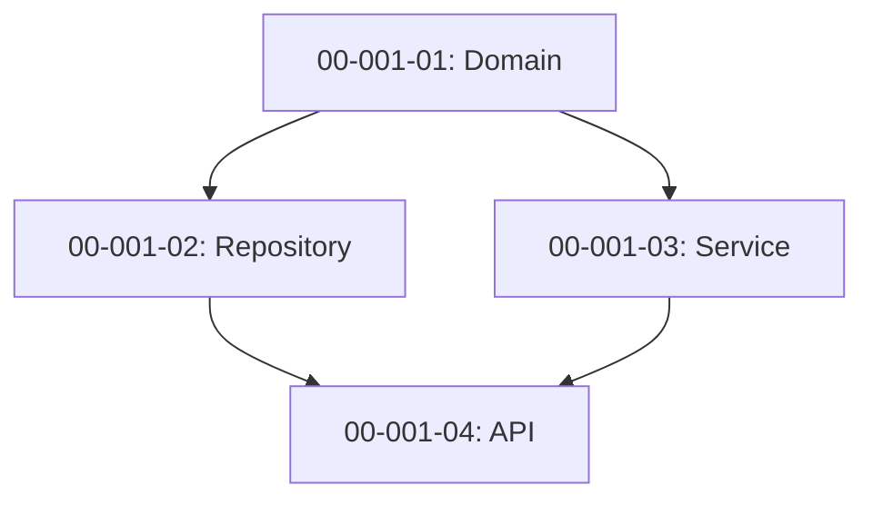

# Design Command Full Specification

This document contains the complete specification for `@design`.
For quick reference, see [SKILL.md](../../.claude/skills/design/SKILL.md).

## Overview

The design command decomposes a feature into workstreams with explicit dependencies, scope, and Acceptance Criteria.

## Workstream Decomposition Strategy

### Sequential by Default

Default pattern: Each WS blocks the next (safe, simple):

```
WS-001-01: Domain entities
  ↓
WS-001-02: Repository layer (depends on 01)
  ↓
WS-001-03: Service layer (depends on 02)
  ↓
WS-001-04: API endpoints (depends on 03)
```

### Parallel When Possible

Independent tasks can run in parallel:

```
WS-001-01: Domain entities
  ↓
WS-001-02: Repository layer (depends on 01)
WS-001-03: Service layer (depends on 01)
  ↓ (02 + 03)
WS-001-04: API endpoints (depends on 02, 03)
```

## Complexity-Based Decomposition

### Simple Feature (1-2 workstreams)

**Criteria:**
- Single module/file
- No database changes
- No external integrations
- < 500 LOC total

**Example:**
```
WS-001-01: Add validation function
  - src/validators.py
  - tests/unit/test_validators.py
```

### Medium Feature (3-5 workstreams)

**Criteria:**
- Multiple modules
- Database schema changes
- Internal integrations only
- 500-1500 LOC total

**Example:**
```
WS-001-01: Domain entities
WS-001-02: Database migration
WS-001-03: Repository layer
WS-001-04: Service layer
WS-001-05: API endpoints
```

### Large Feature (6+ workstreams)

**Criteria:**
- Multiple layers
- Complex database changes
- External integrations
- > 1500 LOC total

**Example:**
```
WS-001-01: Domain entities
WS-001-02: Value objects
WS-001-03: Database migration
WS-001-04: Repository interface
WS-001-05: Repository implementation
WS-001-06: Service interface
WS-001-07: Service implementation
WS-001-08: API controllers
WS-001-09: External API integration
WS-001-10: Frontend components
```

## Scope File Detection

Workstream scope defines files that can be edited:

### Automatic Detection Heuristics

**Domain workstream:**
```
scope_files:
  - src/domain/{entity}.py
  - src/domain/{entity}_*.py
  - tests/unit/test_{entity}.py
```

**Repository workstream:**
```
scope_files:
  - src/infrastructure/repositories/{entity}_repository.py
  - tests/unit/test_{entity}_repository.py
  - tests/integration/test_{entity}_repository_integration.py
```

**Service workstream:**
```
scope_files:
  - src/application/services/{entity}_service.py
  - tests/unit/test_{entity}_service.py
```

**API workstream:**
```
scope_files:
  - src/presentation/api/endpoints/{entity}.py
  - tests/api/test_{entity}_endpoints.py
```

### Manual Scope Definition

For non-standard workstreams, define scope manually:

```yaml
ws_id: 00-001-05
title: Refactor authentication
scope_files:
  - src/auth/service.py
  - src/auth/validators.py
  - src/auth/models.py
  - tests/unit/test_auth_service.py
  - tests/unit/test_auth_validators.py
```

## Dependency Patterns

### Layer Dependencies

```
Domain (no dependencies)
  ↓
Repository (depends on Domain)
  ↓
Service (depends on Repository)
  ↓
API (depends on Service)
```

### Database Migration Dependencies

```
Domain entities
  ↓
Database migration (depends on entities)
  ↓
Repository (depends on migration)
```

### Integration Dependencies

```
Internal service
  ↓
External API client
  ↓
Integration service (depends on both)
```

## Interactive Planning

Use AskUserQuestion to gather requirements:

### Complexity Assessment

```markdown
What is the complexity level of this feature?
- Simple (1-2 workstreams): Straightforward, minimal integration
- Medium (3-5 workstreams): Standard complexity, some integration points
- Large (6+ workstreams): Complex, multiple integrations, significant changes
```

### Layer Selection

```markdown
Which layers need implementation? (multi-select)
- Domain: Business logic, entities, value objects
- Repository: Data access, persistence layer
- Service: Application services, use cases
- API/Presentation: Endpoints, controllers, UI
```

### Database Changes

```markdown
Does this feature require database changes?
- Yes, new tables
- Yes, modify existing tables
- Yes, new migrations only
- No database changes
```

### External Integrations

```markdown
Does this feature integrate with external services?
- Yes, REST API
- Yes, GraphQL API
- Yes, message queue
- Yes, third-party SDK
- No external integrations
```

## Workstream Template

```markdown
---
ws_id: 00-001-01
feature: F001
status: backlog
size: MEDIUM
project_id: 00
depends_on: []
scope_files:
  - src/domain/user.py
  - tests/unit/test_user.py
---

## 00-001-01: User Domain Entity

### 🎯 Goal

Create User domain entity with validation.

### Acceptance Criteria

- [ ] AC1: User entity created with email, name, password
- [ ] AC2: Email validation enforced
- [ ] AC3: Password hashing on creation
- [ ] AC4: Immutable after creation (value object pattern)

### Context

Users are the core entity for authentication. Need immutable value object with validation.

### Dependencies

None (domain layer, no dependencies)

### Steps

1. Create User entity class
2. Add email validation
3. Add password hashing
4. Make immutable with frozen dataclass

### Prerequisites

None

### Expected Output

- `src/domain/user.py` with User entity
- `tests/unit/test_user.py` with 100% coverage
```

## Dependency Graph Visualization

Use Mermaid for visual representation:



Generate with:

```bash
sdp ws graph {feature-id} --format mermaid
```

## Common Design Patterns

### CRUD Feature

```
1. Domain entities
2. Database migration
3. Repository layer
4. Service layer (with validation)
5. API endpoints (CRUD)
```

### Integration Feature

```
1. Domain models
2. External API client
3. Integration service
4. Event handlers
5. API endpoints
```

### Refactoring Feature

```
1. Extract interface
2. Implement new classes
3. Update call sites
4. Remove old code
5. Update tests
```

## Sizing Guidelines

| Size | LOC | Complexity | Duration Estimate |
|------|-----|------------|-------------------|
| SMALL | < 500 | Simple, 1-2 files | 1-2 hours |
| MEDIUM | 500-1500 | Standard, 3-5 files | 2-4 hours |
| LARGE | > 1500 | Complex, 6+ files | Must split into 2+ WS |

**Rule:** If WS estimate is > 1500 LOC, split into smaller workstreams.

## Quality Checks

After decomposition, verify:

- [ ] All workstreams have clear Goal
- [ ] All workstreams have Acceptance Criteria
- [ ] All workstreams have scope_files defined
- [ ] Dependencies are explicit and acyclic
- [ ] Size is appropriate (no LARGE workstreams)
- [ ] Topological sort is possible

## Examples

See [docs/examples/design/](../examples/design/) for:
- Sample decompositions
- Dependency graphs
- Interactive planning sessions
