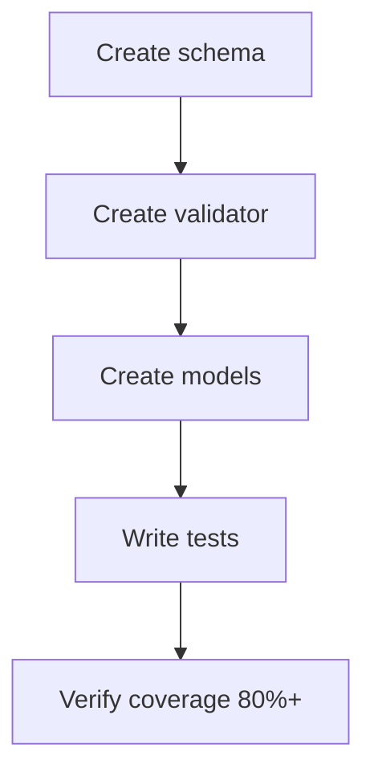

## Intent Schema + Validation

### Goal

Create machine-readable intent specification with JSON schema validation.

### Prerequisites

**Must exist before starting:**
- Python 3.10+ installed
- poetry available

**Check command:**
```bash
python --version && poetry --version
```

### Execution Graph



### Files

**Create:** `docs/schema/intent.schema.json` (~150 LOC)
**Create:** `src/sdp/schema/validator.py` (~100 LOC)
**Create:** `src/sdp/schema/models.py` (~100 LOC)
**Create:** `tests/unit/schema/test_validator.py` (~80 LOC)
**Create:** `tests/unit/schema/test_models.py` (~40 LOC)
**Modify:** `pyproject.toml` (add jsonschema dependency)

### Steps

**Step 1: Write intent schema JSON**
```bash
mkdir -p docs/schema
```

**File:** `docs/schema/intent.schema.json`
```json
{
  "$schema": "http://json-schema.org/draft-07/schema#",
  "type": "object",
  "required": ["problem", "users", "success_criteria"],
  "properties": {
    "problem": {"type": "string", "minLength": 50},
    "users": {"type": "array", "minItems": 1},
    "success_criteria": {"type": "array", "minItems": 1}
  }
}
```

**Step 2: Write schema validator test**
```python
# tests/unit/schema/test_validator.py
def test_validate_valid_intent():
    validator = IntentValidator()
    validator.validate({...})
```

**Verify:** `pytest tests/unit/schema/test_validator.py -v` → Expected: FAIL (no module)

**Step 3: Implement validator**
```python
# src/sdp/schema/validator.py
class IntentValidator:
    def validate(self, intent: dict[str, Any]) -> None:
        jsonschema.validate(instance=intent, schema=self._schema)
```

**Verify:** `pytest tests/unit/schema/` → Expected: PASS with coverage ≥80%

**Step 4: Add jsonschema dependency**
```bash
poetry add jsonschema
```

### Acceptance Criteria

- [ ] JSON schema file created
- [ ] IntentValidator validates against schema
- [ ] Intent dataclass models (from_dict, to_dict)
- [ ] Test coverage ≥80%
- [ ] mypy --strict passes
