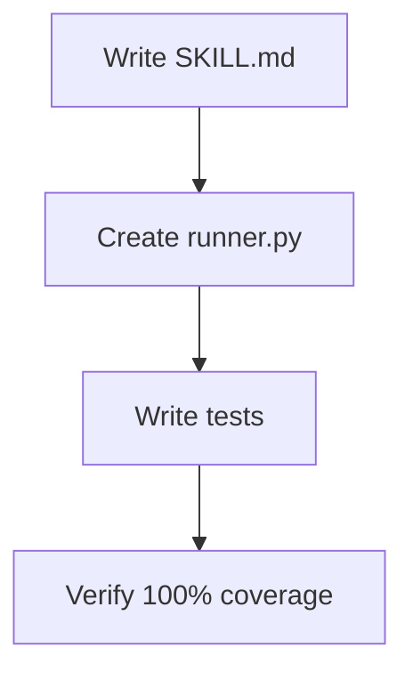

## /tdd Skill (Reimplemented)

### Goal

Create TDD cycle enforcement skill with Red→Green→Refactor phases.

### Prerequisites

**Check command:**
```bash
ls .claude/skills/
```

### Execution Graph



### Files

**Create:** `.claude/skills/tdd/SKILL.md` (~60 LOC)
**Create:** `src/sdp/tdd/runner.py` (~70 LOC)
**Create:** `src/sdp/tdd/__init__.py` (~5 LOC)
**Create:** `tests/unit/tdd/test_runner.py` (~60 LOC)

### Steps

**Step 1: Write TDD skill**
```markdown
# .claude/skills/tdd/SKILL.md
## TDD Cycle
### Phase 1: RED - Write Failing Test
### Phase 2: GREEN - Minimal Implementation
### Phase 3: REFACTOR - Improve Code
```

**Step 2: Write TDD runner**
```python
# src/sdp/tdd/runner.py
class TDDRunner:
    def red_phase(self, test_path):
        # Expects failure
    def green_phase(self, test_path):
        # Expects success
    def refactor_phase(self, test_path):
        # Still expects success
```

**Verify:** `pytest tests/unit/tdd/` → Expected: PASS, 100% coverage

**Step 3: Mark as internal**
```markdown
# INTERNAL SKILL - used by @build
```

### Acceptance Criteria

- [ ] SKILL.md defines Red→Green→Refactor cycle
- [ ] TDDRunner with three phases
- [ ] Tests for all phases
- [ ] 100% test coverage
- [ ] Marked as INTERNAL in docs
