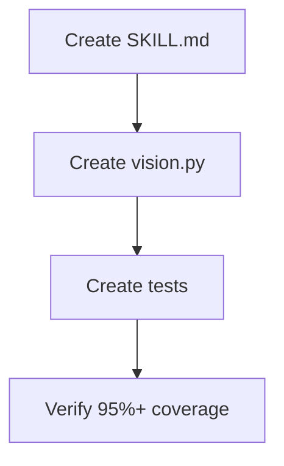

## /feature Skill (New Unified Entry)

### Goal

Create unified feature development entry point with progressive disclosure.

### Prerequisites

**Check command:**
```bash
ls docs/schema/intent.schema.json
```

### Execution Graph



### Files

**Create:** `.claude/skills/feature/SKILL.md` (~90 LOC)
**Create:** `src/sdp/feature/__init__.py` (~5 LOC)
**Create:** `src/sdp/feature/vision.py` (~100 LOC)
**Create:** `tests/unit/feature/test_vision.py` (~50 LOC)

### Steps

**Step 1: Write feature skill**
- Vision interview (3-5 questions)
- Generate PRODUCT_VISION.md
- Technical interview (5-8 questions)
- Generate intent.json
- Transition to @design

**Step 2: Implement vision.py**
```python
class ProductVision:
    mission: str
    users: list[str]
    success_metrics: list[str]

class VisionManager:
    def save(self, vision): ...
    def load(self): ...
```

**Verify:** `pytest tests/unit/feature/ -v --cov=sdp.feature --cov-fail-under=95`

### Acceptance Criteria

- [ ] Skill defined with 5 phases
- [ ] ProductVision dataclass
- [ ] VisionManager for save/load
- [ ] Test coverage ≥95%
