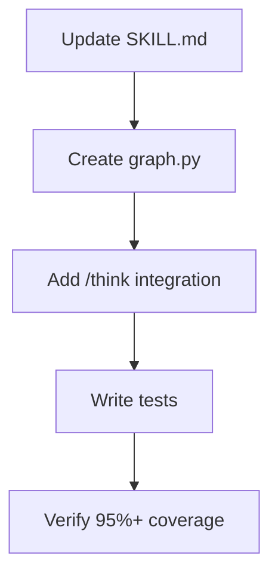

## @design Skill Update

### Goal

Enhance @design with execution graphs and dependency graph module.

### Execution Graph



### Files

**Modify:** `.claude/skills/design/SKILL.md` (+120 LOC)
**Create:** `src/sdp/design/__init__.py` (~5 LOC)
**Create:** `src/sdp/design/graph.py` (~110 LOC)
**Create:** `tests/unit/design/test_graph.py` (~90 LOC)

### Steps

**Step 1: Add enhanced WS template**
```markdown
---
ws_id: 00-XXX-YY
dependencies: [WS IDs]
oneshot_ready: true
status: completed
completed: "2026-01-30"
---
## Prerequisites
## Execution Graph
## Files
## Steps
```

**Step 2: Create DependencyGraph**
```python
class DependencyGraph:
    def add(self, node: WorkstreamNode)
    def topological_sort(self) -> list[str]
    def get_ready_workstreams(self, completed) -> list[str]
    def to_mermaid(self) -> str
```

**Step 3: Add /think integration**
- Call `/think` for complex architecture

**Verify:** `pytest tests/unit/design/ -v --cov=sdp.design --cov-fail-under=95`

### Acceptance Criteria

- [ ] Enhanced WS template in SKILL.md
- [ ] DependencyGraph implemented
- [ ] Topological sort works
- [ ] Mermaid graph generation
- [ ] /think integration documented
- [ ] Test coverage ≥95%
