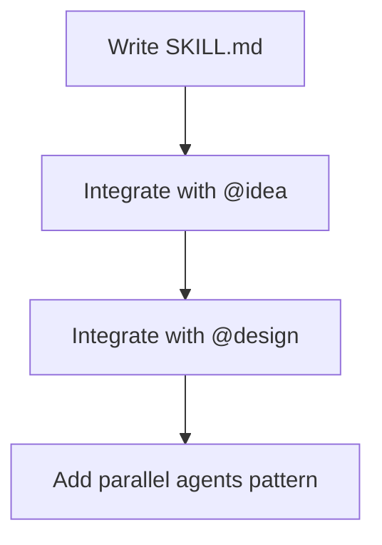

## /think Skill

### Goal

Create deep structured thinking skill with parallel expert agents.

### Execution Graph



### Files

**Create:** `.claude/skills/think/SKILL.md` (~140 LOC)

### Steps

**Step 1: Define skill structure**
- 4-phase thinking process
- Single-agent mode (simple)
- Parallel-agent mode (complex)

**Step 2: Define expert roles**
| Expert | Focus |
|--------|-------|
| @architect | System design |
| @security | Threats, auth |
| @performance | Latency, scalability |
| @ux | User experience |
| @ops | Deployability |

**Step 3: Parallel agents pattern**
```python
Task(
    subagent_type="general-purpose",
    prompt="You are the ARCHITECT expert...",
    description="Architect analysis"
)
# Launch other experts in parallel
```

**Step 4: Integrate with @idea and @design**
- @idea calls /think for complex requirements
- @design calls /think for architecture

### Acceptance Criteria

- [ ] SKILL.md with 4-phase process
- [ ] Expert roles defined
- [ ] Parallel agents pattern
- [ ] Single-agent fallback
- [ ] Integration in @idea/@design
- [ ] Marked as INTERNAL
