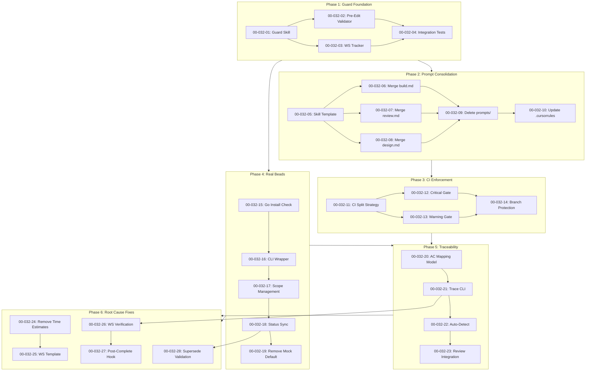

# F032: SDP Protocol Enforcement Overhaul

## Problem Statement

Агенты игнорируют правила SDP потому что:
1. Промпты дублируются в 5 местах (skills, prompts/commands, .cursorrules, PROTOCOL.md, CLAUDE.md)
2. Промпты слишком длинные (400-500 строк) — агенты теряют фокус
3. CI не блокирует, только предупреждает (`continue-on-error: true`)
4. Beads работает в mock-режиме по умолчанию
5. Review не проверяет трассируемость требований (AC → Test)
6. Нет механизма enforcement до коммита

### Root Cause Analysis (Phase 6)

Анализ существующих WS выявил дополнительные причины:

| # | Причина | Доказательство | Решение |
|---|---------|----------------|---------|
| 7 | **WS сами нарушают правила** | `estimated_duration: "2-3h"` в design skill | WS-24: Удалить time estimates |
| 8 | **WS содержат готовый код** | WS-00-020-01: 332 строки с полным кодом | WS-25: Только контракты |
| 9 | **Нет верификации completion** | Можно написать "✅ DONE" без работы | WS-26, WS-27: Автопроверка |
| 10 | **Orphan supersedes** | F012: 14 WS superseded без замены | WS-28: Валидация supersede |

**Ключевой вывод:** Проблема не в агентах — система не enforcement'ит свои правила.

## Solution

```
┌──────────────────────────────────────────────────────────────────────┐
│                     SDP ENFORCEMENT ARCHITECTURE                      │
├──────────────────────────────────────────────────────────────────────┤
│                                                                       │
│  ┌─────────────────┐    ┌─────────────────┐    ┌─────────────────┐  │
│  │  Consolidated   │───→│   @guard Skill   │───→│   Validators    │  │
│  │   Skills (1x)   │    │  (Pre-Edit Gate) │    │  (Python CLI)   │  │
│  └─────────────────┘    └─────────────────┘    └─────────────────┘  │
│          │                      │                      │             │
│          │                      ▼                      ▼             │
│          │              ┌─────────────────┐    ┌─────────────────┐  │
│          │              │   Real Beads    │    │  CI Split Gate  │  │
│          │              │   (Go + CLI)    │    │ (Block/Warn)    │  │
│          │              └─────────────────┘    └─────────────────┘  │
│          │                      │                      │             │
│          ▼                      ▼                      ▼             │
│  ┌───────────────────────────────────────────────────────────────┐  │
│  │                  TRACEABILITY LAYER                            │  │
│  │     Requirement → Test → Implementation → Review               │  │
│  └───────────────────────────────────────────────────────────────┘  │
│                                                                       │
└──────────────────────────────────────────────────────────────────────┘
```

## Phases

### Phase 1: Guard Foundation (WS-01 to WS-04)
Pre-edit enforcement через @guard skill.

### Phase 2: Prompt Consolidation (WS-05 to WS-10)
Сокращение промптов до <100 строк, мерж в skills.

### Phase 3: CI Enforcement (WS-11 to WS-14)
Split strategy: critical блокирует, warning комментирует.

### Phase 4: Real Beads (WS-15 to WS-19)
Интеграция с real Beads CLI (Go).

### Phase 5: Traceability (WS-20 to WS-23)
AC → Test mapping и автоматическая проверка.

### Phase 6: Root Cause Fixes (WS-24 to WS-28)
Исправление корневых причин почему агенты игнорируют WS:
- Удаление time estimates из skills и WS
- Упрощение WS template (только контракты, не полный код)
- Автоматическая верификация завершения WS
- Валидация supersede (нет orphan supersedes)

## Execution Graph



## Summary

| WS ID | Title | Size | LOC | Dependencies | Phase |
|-------|-------|------|-----|--------------|-------|
| 00-032-01 | Guard Skill Foundation | M | 400 | None | 1 |
| 00-032-02 | Pre-Edit Validator | M | 350 | 01 | 1 |
| 00-032-03 | Active WS Tracker | S | 200 | 01 | 1 |
| 00-032-04 | Guard Integration Tests | S | 250 | 02,03 | 1 |
| 00-032-05 | Skill Template Standard | S | 150 | None | 2 |
| 00-032-06 | Merge build.md | M | 300 | 05 | 2 |
| 00-032-07 | Merge review.md | M | 350 | 05 | 2 |
| 00-032-08 | Merge design.md | S | 200 | 05 | 2 |
| 00-032-09 | Delete prompts/commands/ | S | 50 | 06,07,08 | 2 |
| 00-032-10 | Update .cursorrules | S | 50 | 09 | 2 |
| 00-032-11 | CI Split Strategy | S | 150 | None | 3 |
| 00-032-12 | Critical Gate Workflow | M | 200 | 11 | 3 |
| 00-032-13 | Warning Gate Workflow | M | 250 | 11 | 3 |
| 00-032-14 | Branch Protection | S | 100 | 12,13 | 3 |
| 00-032-15 | Beads Go Install Check | S | 150 | None | 4 |
| 00-032-16 | Beads CLI Wrapper | M | 300 | 15 | 4 |
| 00-032-17 | Beads Scope Management | M | 250 | 16 | 4 |
| 00-032-18 | Beads Status Sync | S | 200 | 17 | 4 |
| 00-032-19 | Remove Mock Default | S | 50 | 18 | 4 |
| 00-032-20 | AC Test Mapping Model | S | 200 | None | 5 |
| 00-032-21 | Traceability CLI | M | 300 | 20 | 5 |
| 00-032-22 | Auto-Detect Test Coverage | M | 350 | 21 | 5 |
| 00-032-23 | Review Traceability Check | S | 150 | 22 | 5 |
| 00-032-24 | Remove Time Estimates | S | 150 | None | 6 |
| 00-032-25 | WS Template Simplification | M | 300 | 24 | 6 |
| 00-032-26 | Automated WS Verification | M | 300 | 21 | 6 |
| 00-032-27 | Post-WS-Complete Hook | S | 100 | 26 | 6 |
| 00-032-28 | Supersede Validation | S | 150 | 18 | 6 |

**Total:** 30 workstreams, ~6,750 LOC

### Phase 7: Review Follow-up (WS-29 to WS-30)

Added after F032 review (CHANGES_REQUESTED):

| WS ID | Title | Size | LOC | Dependencies | Source |
|-------|-------|------|-----|--------------|--------|
| 00-032-29 | AC→Test Mappings | M | 200 | None | Review: 0% traceability |
| 00-032-30 | Validator Coverage | L | 500 | 29 | Review: coverage <80% |

**Related Issue:** [003-f032-ruff-complexity](../../issues/003-f032-ruff-complexity.md) — 8 C901/E501 violations

## Review (2026-01-30)

**Verdict:** APPROVED  
**Report:** [2026-01-30-F032-review.md](../../reports/2026-01-30-F032-review.md)

All gates pass. Ready for deploy.

## Ready to Start (Parallel)

- **00-032-01**: Guard Skill Foundation
- **00-032-05**: Skill Template Standard  
- **00-032-11**: CI Split Strategy
- **00-032-15**: Beads Go Install Check
- **00-032-20**: AC Test Mapping Model
- **00-032-24**: Remove Time Estimates (NEW - Phase 6)
